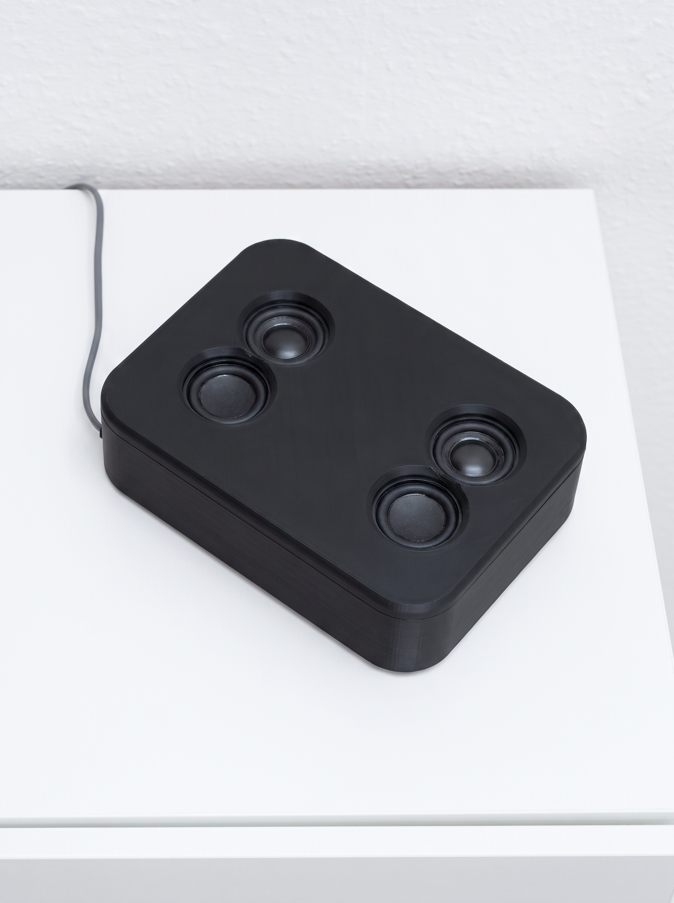
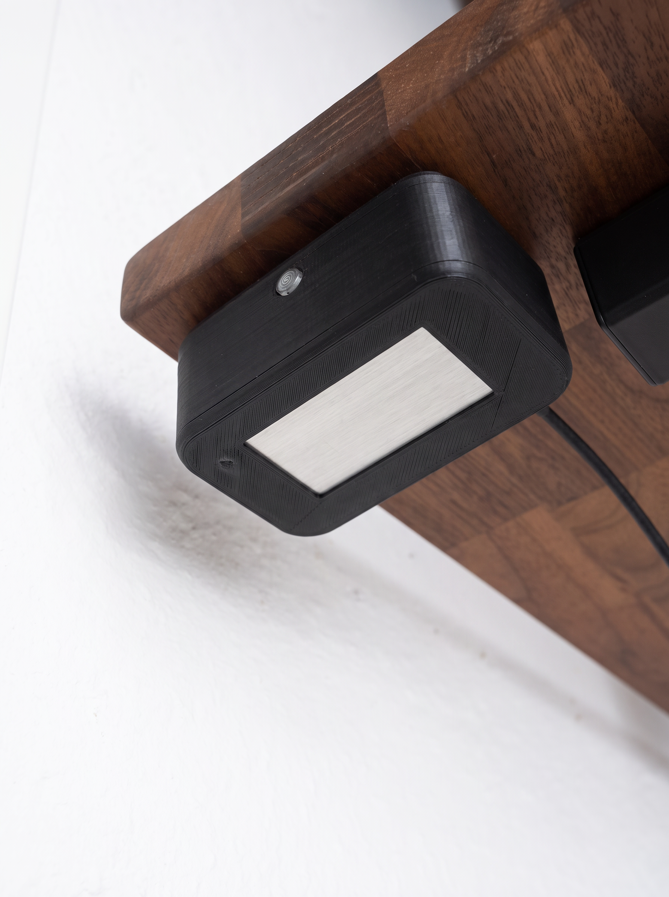
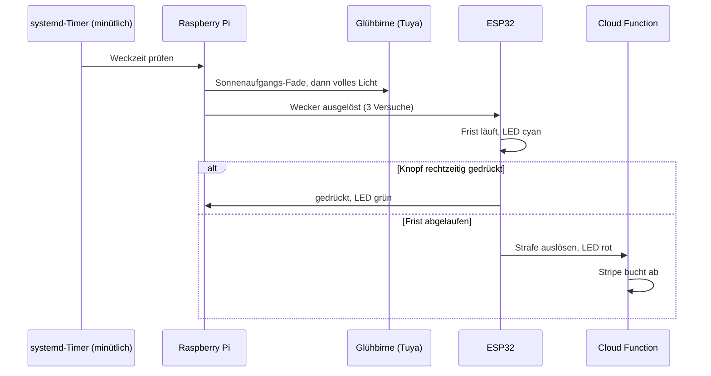

# strafwecker

Ein Wecker, der Geld kostet, wenn man liegen bleibt.

## Die Idee

Aufstehen scheitert nicht am Wecker, sondern daran, dass man ihn vom Bett aus
ausschalten kann. Deshalb ist der Auslöser hier vom Wecker getrennt: Der
Raspberry Pi im Schlafzimmer klingelt, und ein ESP32 im Nebenraum startet
gleichzeitig eine Frist von standardmäßig fünf Minuten. Wird sein Knopf nicht
rechtzeitig gedrückt, ruft der ESP32 eine Cloud Function auf, die per Stripe
eine Strafe abbucht. Den Betrag legt die Cloud Function fest, bei mir sind es
aktuell 2 €. Aufstehen ist billiger.

Entscheidend ist die Arbeitsteilung: Der Pi macht nur den Ton und das Licht,
mit der Strafe hat er nichts zu tun. Die kontrolliert allein der ESP32, und um
den zu deaktivieren, muss man aufstehen. Den Pi auszustecken und
weiterzuschlafen funktioniert deshalb nicht, es gibt keinen anderen Weg als
den Knopf.

<p>


</p>

*Echte Fotos des Aufbaus, per KI retuschiert (Hand, Staub und lose Kabel entfernt).*

## Wie ein Morgen abläuft

**Vor der Weckzeit.** Wenn für den Wecker ein Sonnenaufgangs-Fade eingestellt
ist, beginnt die smarte Glühbirne 5 bis 30 Minuten vorher zu leuchten, in zwei
Phasen: zuerst wandert bei minimaler Helligkeit die Farbe von dunklem Rot zu
warmem Gelb, dann steigt die Helligkeit in warmem Weiß bis zum Maximum. Getaktet
wird das von einem systemd-Timer, der jede Minute prüft, welcher Wecker ansteht.

**Zur Weckzeit.** Der Pi spielt den Weckton, schaltet das Licht voll an und
benachrichtigt den ESP32, mit drei Versuchen, falls der erste fehlschlägt. Der
ESP32 startet seine Frist und zeigt den Zustand über eine LED: Cyan heißt
warten, Grün heißt rechtzeitig gedrückt, Rot heißt Frist verpasst.

**Der Knopf.** Der Knopf ist real keine Taste, sondern eine Aluminiumplatte
als kapazitiver Touch-Sensor, mit Magneten unter der Schreibtischplatte im
Nebenraum befestigt: aufstehen, hingehen, berühren. Rechtzeitig berührt
meldet der ESP32 das an den Pi und alles ist gut. Läuft die Frist ab, ruft der ESP32 selbst die Cloud Function auf und
die Strafe wird gebucht. Der Weckton stoppt am Pi nach zehn Minuten von
alleine, und am Pi sitzt auch ein eigener Stopp-Knopf für den Ton. Beides
ändert an der Strafe nichts, denn die läuft beim ESP32.

**Mittagsschlaf.** Neben Weckern gibt es Nap-Timer, standardmäßig 15 Minuten.
Am Ende geht das Licht direkt voll an, ohne Fade, und auch hier lässt sich der
ESP32-Knopf zuschalten, damit der Mittagsschlaf nicht zum Nachmittagsschlaf
wird. Der Knopf ist je Wecker und je Nap einzeln zuschaltbar, so wecken
Wecker ohne Strafdrohung genauso wie welche mit.



## Die App

Weckzeiten, Naps und Auswertung laufen über eine Web-App, gebaut für das
Handy: Wecker anlegen mit Wochentagen und wählbarem Sonnenaufgangs-Fade,
Nap-Timer mit Licht- und Knopf-Option, dazu ein Verlauf, der zu jedem Wecken
festhält, ob und wie schnell gedrückt wurde, und eine Netzwerk-Übersicht des
Pi.


Die Oberfläche lässt sich ohne Hardware ausprobieren:
`frontend/utils/mockApi.ts` ersetzt im Entwicklungsmodus alle Netzwerkaufrufe
durch einen In-Memory-Store mit Beispiel-Weckzeiten.

```bash
cd frontend && npm install && npm run dev
```

## Architektur

- **Raspberry Pi** im Schlafzimmer: FastAPI-Anwendung mit SQLite, spielt den
  Ton, steuert die Tuya-Glühbirne lokal über `tinytuya` und hält Wecker,
  Naps und Logs. Vier systemd-Timer takten den Betrieb: minütlich Wecker und
  Fade, minütlich Netzwerk-Messwerte, ein Wächter, der den Pi bei
  Netzausfall neu startet (vorher prüft er, ob gerade ein Wecker ansteht),
  und eine tägliche Datenbank-Aufräumung.
- **ESP32** im Nebenraum: MicroPython, eine Aluminium-Touchfläche als Knopf,
  eine LED, ein Watchdog.
  Er bekommt vom Pi nur den Startschuss, alles Weitere entscheidet er selbst.
- **Cloud Function** auf GCP: nimmt den Aufruf des ESP32 entgegen und löst
  die Stripe-Zahlung aus. Bewusst außerhalb der Wohnung, und ihr Code liegt
  nicht in diesem Repository.
- **Frontend** auf Vercel: Next.js 16 mit React und TypeScript. Die
  API-Aufrufe laufen über serverseitige Route Handler an den Pi, der
  API-Schlüssel bleibt dadurch auf dem Server. Der Zugang ist über ein
  Token oder eine konfigurierbare IP-Allowlist abgesichert
  (`frontend/proxy.ts`).

Der API-Schlüssel des Pi-Backends lag anfangs im Frontend und wanderte hinter
den serverseitigen Proxy. Der ESP32 authentifiziert sich mit einem eigenen
Schlüssel, damit der Zahlungsaufruf nicht von jedem Gerät im Netz kommen
kann. Die Konfiguration wird über `pydantic-settings` erzwungen: fehlt ein
Wert, startet die Anwendung gar nicht, denn eine halb konfigurierte Instanz,
die klingelt, aber nicht abbuchen kann, wäre schlechter als keine.

## Aufbau

```text
backend/     FastAPI-Anwendung, SQLite, Alembic-Migrationen, systemd-Units, Tests
esp32/       MicroPython-Firmware (per USB geflasht) und Tests
frontend/    Next.js-App mit Mock-Modus
docs/        datierte Spezifikationen und Pläne (docs/superpowers/)
```

## Tests

```bash
cd backend && pip install poetry && poetry install
export API_KEY=… TUYA_DEV_ID=… TUYA_LOCAL_KEY=… TUYA_IP=… ESP32_IP=…
poetry run python -m pytest tests             # 126 Tests
poetry run python -m pytest ../esp32/tests    #   6 Tests
```

132 Tests, alle grün. Die Suiten werden getrennt aufgerufen, weil beide
Testordner `tests` heißen und pytest sie in einem gemeinsamen Aufruf nicht
auseinanderhält. Die erwarteten Konfigurationsnamen stehen in
`backend/.env.example`, die Abhängigkeiten in `backend/pyproject.toml`.

## Zur Arbeitsweise

`docs/superpowers/` enthält die Spezifikationen und Pläne dieses Projekts,
datiert und vor der jeweiligen Umsetzung entstanden, darunter der
Architekturentwurf, der dem heutigen Aufbau zugrunde liegt, und die
Überlegungen zum Deployment auf den Pi. Gebaut habe ich es mit
Coding-Agenten. Der Entwurf und die Entscheidungen sind meine, den Code hat
die KI geschrieben.

## Zu diesem Repository

Entwickelt im Mai 2026 und seitdem täglich im Einsatz, veröffentlicht als
Momentaufnahme im Juli 2026 aus einem privaten Repository mit 102 Commits.
Der Weckton ist nicht enthalten, siehe `backend/ALARM-SOUND.md`, und der
Code der Cloud Function gehört nicht zu diesem Repository. Private Adressen
stehen nicht im Code, die Allowlist des Frontends wird über eine
Umgebungsvariable gefüllt.

## Lizenz

MIT
